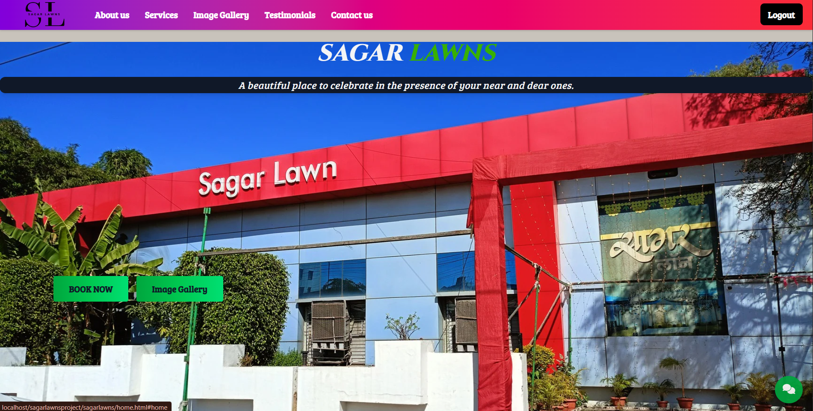

# 🌿 Sagar Lawns - Function Hall and Lawn Booking System

### 🏠 Home Page


### 📜 About Us Page
 

### 📷 Photo Galley Page


**Sagar Lawns** is a PHP-based web application built as a college project to manage bookings for a function lawn and hall. Users can book any type of event and choose from a variety of options such as:
- Lawn only
- Hall only
- Both lawn and hall
- Decoration types
- Food requirements

This system streamlines event bookings and allows easy customization based on user preferences.

---

## 🛠️ Tech Stack

- PHP
- MySQL (phpMyAdmin)
- HTML, Tailwind CSS
- JavaScript
- XAMPP for local development

---

## 📦 How to Run This Project Locally

1. **Install XAMPP:**
   - Download and install XAMPP from [https://www.apachefriends.org/index.html](https://www.apachefriends.org/index.html)
   - Open the XAMPP control panel and start **Apache** and **MySQL** modules

2. **Clone or Download the Project:**
   - Clone the repo:
     ```bash
     git clone https://github.com/Sumedh-mhaske/sagar-lawns-project.git
     ```
   - Or download the ZIP and extract it

3. **Move to `htdocs` Folder:**
   - Copy the entire project folder
   - Paste it inside the `htdocs` directory of your XAMPP installation:
     ```bash
     C:/xampp/htdocs/
     ```

4. **Rename Folder (Optional):**
   - You can rename the folder to anything, e.g. `sagarlawnsproject`
   - The site will then be accessible at:
     ```
     http://localhost/sagarlawnsproject/sagarlawns
     ```

---

## 🧩 Database Setup

1. Open your browser and go to:
http://localhost/phpmyadmin


2. Create a new database:
- Click **"New"**
- Name the database: `sagarlawns`

3. Import the SQL file:
- Click the newly created database
- Go to **Import** tab
- Upload the file: `sagarlawns.sql` (provided in the project folder)

---

## 🤝 How to Contribute

Contributions, issues, and feature requests are welcome! Follow the steps below to contribute to this project:

### 📌 Steps to Contribute:

1. **Fork this repository**  
   Click the `Fork` button at the top right corner of this page.

2. **Clone your forked repository**  
   Open your terminal and run:
   ```bash
   git clone https://github.com/your-username/sagar-lawns-project.git
   
3. **Navigate to the project directory**<br />
   ```
   cd sagar-lawns-project

4. **Create a new branch**<br />
   ```
   git checkout -b feature/your-feature-name

5. **Make your changes**<br />
   Add or improve features, fix bugs, or update documentation.

6. **Commit your changes**<br />
   ```
   git add .
   git commit -m "Add: Your meaningful commit message"

7. **Push to your forked repository**<br />
   ```
   git push origin feature/your-feature-name

8. **Create a Pull Request**<br />
   Go to your forked repo on GitHub and click "Compare & pull request". Add a clear title and description of your changes.

